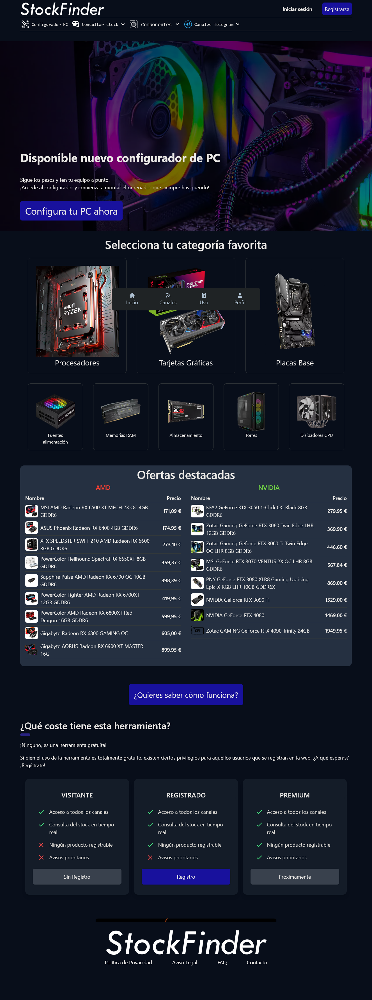

Herramienta para el seguimiento de stock y precios de componentes informáticos (fuentes de alimentación, tarjetas gráficas, procesadores, placas base, memorias ram, almacenamiento, cajas de PC y disipadores de CPU)

# Puntos claves
- Diferenciar cada producto individualmente y comparar los precios en diferentes tiendas
- Permitir a usuarios introducir productos y hacer seguimiento de éstos
- Comparador de componentes
- Configurador de PC

# Stack

Component           |  Language / Framework / Application   |
-----------         | -----------                           |
Reserve proxy       | Traefik                               |
FrontEnd            | JavaScript / NexJS (React)            | 
BackEnd             | Python                                |
Main database       | PostgreSQL                            |
Secondary database  | SQLite                                |
Images Server       | NGINX                                 |
Proxies             | Squid                                 |
Scheduler           | Prefect                               |
Monitoring          | Prometheus, InfluxDB y Grafana        |

All the componentes have been deployed on **Docker / Kubernetes**

# Página Web

***https://stockfinder.tech/***

